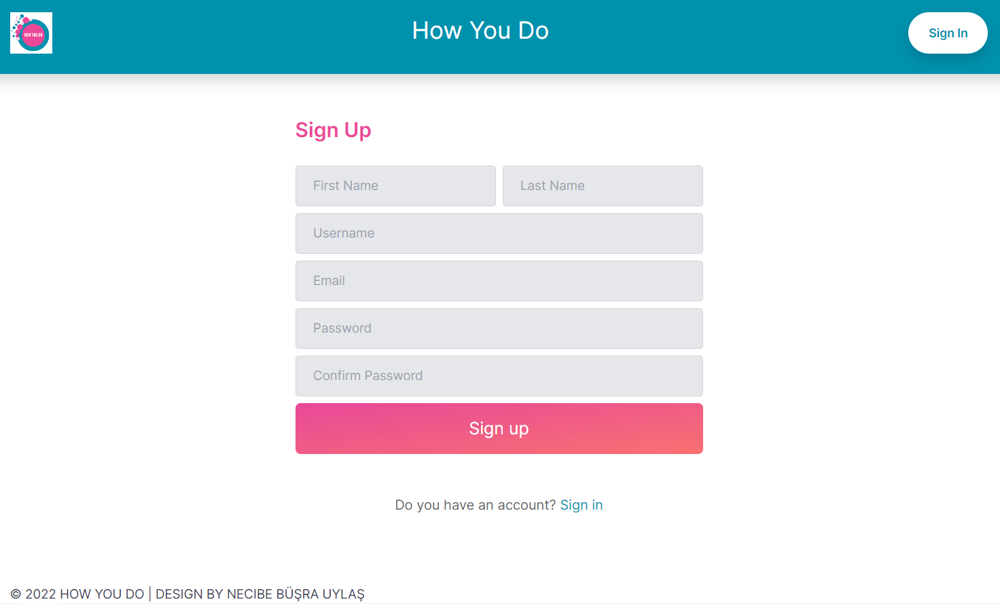
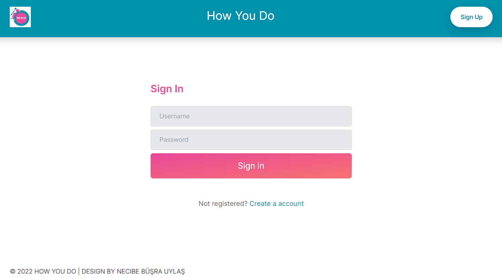
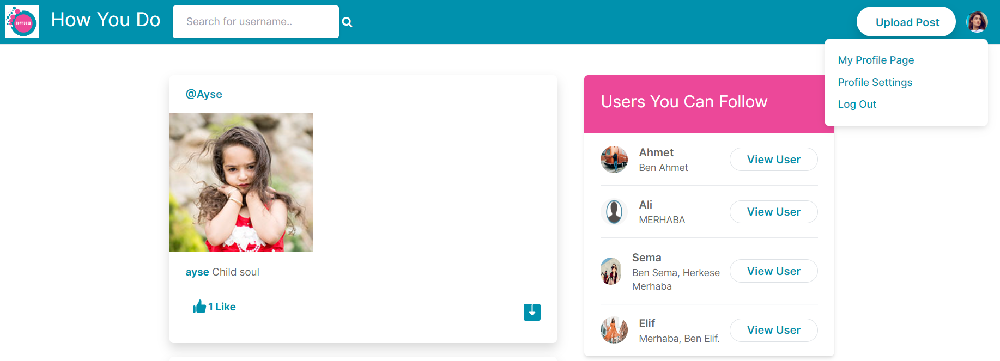
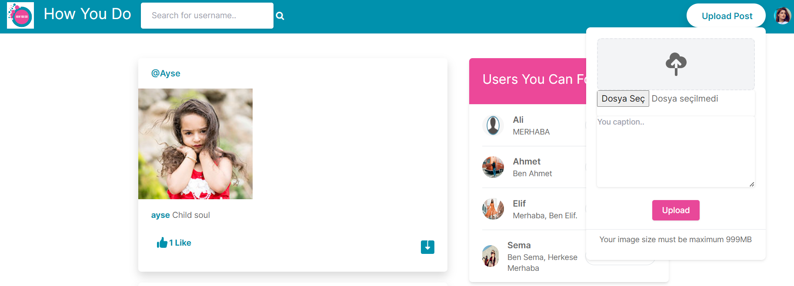
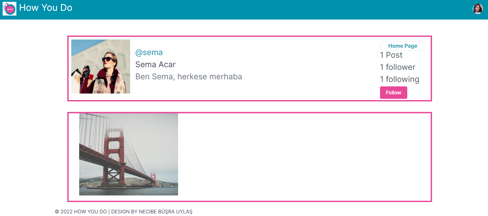
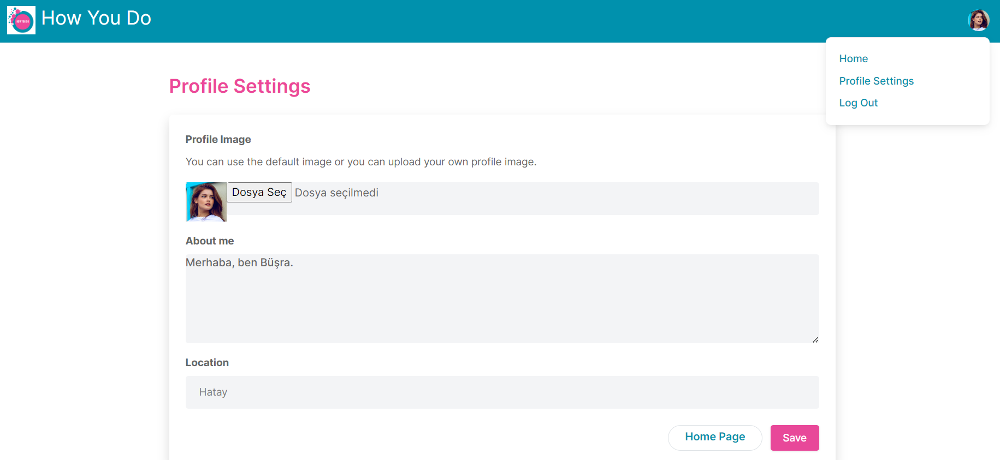
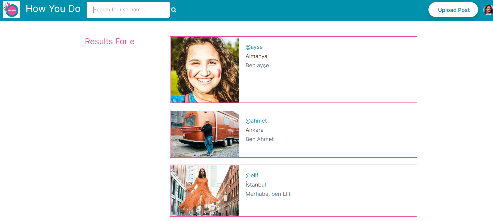

# SocialMedia_HowYouDo 

The backend of the project was developed with Python Django, SQLite, and Frontend developed with HTML, CSS, and Bootstrap.

Django is based on MVT (Model-View-Template) architecture. MVT is a software design pattern for developing a web application.

### MVT Structure
MVT structure consists of following three parts;

Model: The model defines the structure and behavior of the data you want to store through your website. Each Django model you create generates a corresponding database table, where each attribute of the model becomes a field in the table.

View: The View is the second layer of Django’s MVT architecture, a template is useless unless a view renders it to the UI. The view is responsible for accepting web requests and returning appropriate responses (including templates).

Template: A template consists of static parts of the desired HTML output as well as some special syntax describing how dynamic content will be inserted. 

## Database Models

A model in Django is a python class defined by Django to represent data and facilitate the creation, update, and management of the data in the database. When you create a django project, django automatically create an empty SQLite database.

~~~~sql
class Profile(models.Model):
    user = models.ForeignKey(User, on_delete= models.CASCADE) # use user model as foreign key to get the information of current user
    id_user = models.IntegerField() # id of the user who has this profile (user models's id) 
    about = models.TextField(blank=True)
    profileImage = models.ImageField(upload_to='profile_images', default='default_profile_image.png')
    location = models.CharField(max_length=100, blank=True)
    
    def __str__(self):
        return self.user.username
    
class Post(models.Model):
    id = models.UUIDField(primary_key=True, default=uuid.uuid4)
    user = models.CharField(max_length=100)
    image = models.ImageField(upload_to='posted_images')
    caption = models.TextField()
    created_at = models.DateTimeField(default=datetime.now)
    number_of_likes = models.IntegerField(default=0)
    
    def __str__(self):
        return self.user # it's not contain foreign key so no object that has been passed in this class

class LikePost(models.Model):
    post_id = models.CharField(max_length=500)
    username = models.CharField(max_length=100)

    def __str__(self):
        return self.username

class FollowersCount(models.Model):
    follower = models.CharField(max_length=100)
    user = models.CharField(max_length=100)

    def __str__(self):
        return self.user # return the username of followed user
~~~~
## Project Images

### **1.Sign Up Page**

### **2. Sign In Page**

### **3. Index Page**

### **4. Profile Page**

### **5. Profile Settings Page**

### **6. Search Page**

